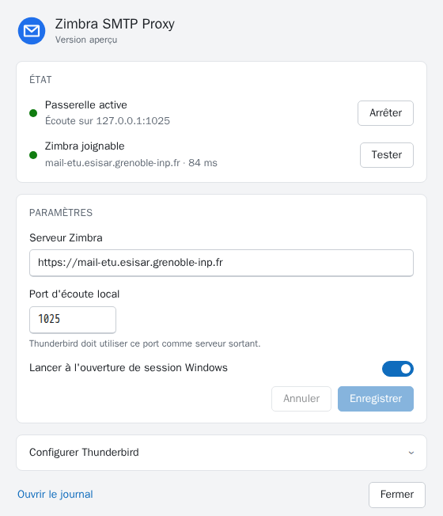

# Zimbra SMTP Proxy

[](https://github.com/Rem7474/zimbra-smtp-proxy/actions/workflows/ci.yml)
[](https://github.com/Rem7474/zimbra-smtp-proxy/actions/workflows/codeql.yml)
[](https://github.com/Rem7474/zimbra-smtp-proxy/releases/latest)

**[Site et téléchargements](https://rem7474.github.io/zimbra-smtp-proxy/)**

Passerelle SMTP locale (`127.0.0.1:1025`) qui relaie les mails de Thunderbird
vers l'API SOAP de Zimbra, pour les serveurs dont le SMTP n'est pas exposé.

Le message MIME est transmis tel quel (upload brut + `SendMsgRequest` avec
`aid`) : pièces jointes, HTML, Cc, Cci et en-têtes de fil sont conservés.

## Zone de notification

| Icône | État |
|---|---|
| Verte | Passerelle active, Zimbra joignable |
| Orange | Passerelle active, Zimbra injoignable |
| Grise | Passerelle arrêtée |

Clic gauche : fenêtre de configuration. Clic droit : menu (état, ouvrir la
configuration, test de connexion Zimbra, démarrer/arrêter, quitter). Zimbra est
testé au démarrage puis toutes les 5 minutes ; une notification signale la
perte et le retour de la connexion.

## Fenêtre de configuration



Page HTML (`ui/settings.html`) affichée par Microsoft Edge WebView2, présent
sur Windows 10 et 11 : état en direct, adresse Zimbra (testée avant
enregistrement), port d'écoute, lancement à l'ouverture de session, réglages
Thunderbird et journal. Elle suit le thème clair/sombre de Windows. Ouvert
dans un navigateur, le fichier affiche un aperçu avec des données fictives.

Configuration et journal : `%APPDATA%\ZimbraSmtpProxy\` (`config.json`,
`proxy.log`).

## Thunderbird

Serveur sortant : `127.0.0.1`, port `1025`, sécurité « Aucune »,
authentification « Mot de passe normal », identifiant = adresse Zimbra.
Décocher « Placer une copie dans Envoyés » : Zimbra l'enregistre déjà.

## Build

Prérequis : Go (version de `go.mod`), Inno Setup 6 (ou Docker pour `build.sh`).

```powershell
.\build.ps1 -Version 1.0.0      # Windows
```
```bash
./build.sh 1.0.0                # Linux / macOS / Git Bash
```

Produit `dist/zimbra-smtp-proxy.exe` et `dist/ZimbraSmtpProxy-Setup.exe`.

L'installeur s'installe par utilisateur, sans droits administrateur, dans
`%LOCALAPPDATA%\Programs\ZimbraSmtpProxy`. Installation silencieuse :
`ZimbraSmtpProxy-Setup.exe /VERYSILENT /TASKS=autostart`.

## CI/CD

| Workflow | Déclencheur | Rôle |
|---|---|---|
| `ci.yml` | push sur `main`, PR | gofmt, go vet, staticcheck (Linux + Windows), tests, govulncheck, build Windows + test d'installation |
| `release.yml` | tag `vX.Y.Z` | build, test d'installation, SHA256SUMS, attestation de provenance, release GitHub |
| `pages.yml` | modification de `site/` | déploie le site GitHub Pages |
| `codeql.yml` | push, PR, hebdomadaire | analyse de sécurité Go et workflows |

Dependabot met à jour chaque semaine les modules Go et les actions.

Publier une version :

```bash
git tag v1.0.1
git push origin v1.0.1
```

## Structure

| Fichier | Rôle |
|---|---|
| `main.go` | Icône de notification, menu, notifications |
| `settings.go` | Actions de la fenêtre de configuration (état, test, enregistrement) |
| `ui_windows.go` | Fenêtre WebView2 et pont JavaScript ↔ Go |
| `ui/settings.html` | Interface de la fenêtre de configuration |
| `gateway.go` | Serveur SMTP et client SOAP Zimbra |
| `config.go` | Lecture/écriture de `config.json` |
| `platform_windows.go` | Instance unique, démarrage auto (clé `Run`) |
| `internal/icon` | Icônes dessinées à l'exécution (pas d'image embarquée) |
| `tools/genicon` | Génère `winres/icon.png` et `installer/app.ico` |
| `installer/setup.iss` | Script Inno Setup |
| `scripts/smoke-test.ps1` | Test d'installation / SMTP / désinstallation (CI) |
| `site/` | Site GitHub Pages |
